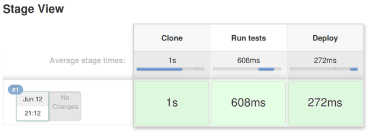

# Pipeline with multiple stages

A pipeline bears this name because of its physical metaphor, bringing business value from a source code repository into increasingly realistic environments and in production. Therefore one basic feature is to define multiple `stages` that are executed sequentially, with the stage `N+1` only starting after the success of stage `N`.

Run
```
./jenkins-cli.sh create-job multiple-stages < jobs/multiple-stages.xml
```

Run the new pipeline at http://localhost:8080/job/multiple-stages/. You should see:



The output is separated into sections labelled by stage as an heading:

```
[Pipeline] {
[Pipeline] stage
[Pipeline] { (Clone)
[Pipeline] checkout
...
[Pipeline] }
[Pipeline] // stage
[Pipeline] stage
[Pipeline] { (Run tests)
[Pipeline] sh
...
[Pipeline] }
[Pipeline] // stage
[Pipeline] stage
[Pipeline] { (Deploy)
[Pipeline] sh
...
[Pipeline] }
[Pipeline] // stage
[Pipeline] }
[Pipeline] // node
[Pipeline] End of Pipeline
Finished: SUCCESS
```

[https://github.com/jenkins-cd-workshop/multiple-stages/blob/master/Jenkinsfile](The pipeline defines the 3 stages) you have just seen. Each stage has two arguments: a string (that is, its name) and a closure containing Groovy code to execute.

The first stage checks out a working copy of the Git repository in the current directory of the build, called a `workspace` in Jenkins. The second one runs a shell command, the most generic construct that can integrate any external deploy tool or testing framework (in this case it's just Python's `unittest`). The third stage could be, for example, a deploy; each stage will only be executed if the previous ones pass.
